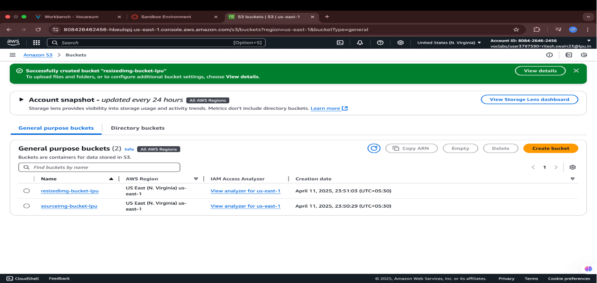
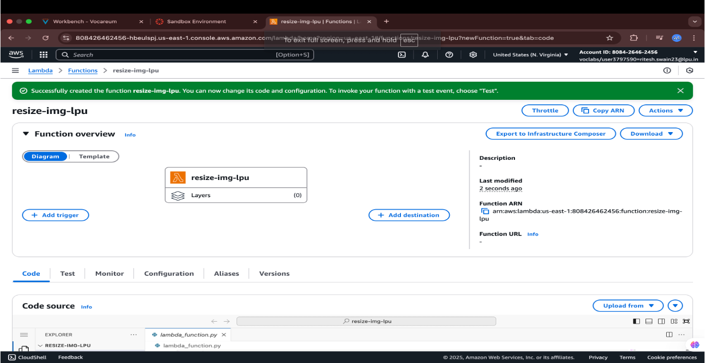
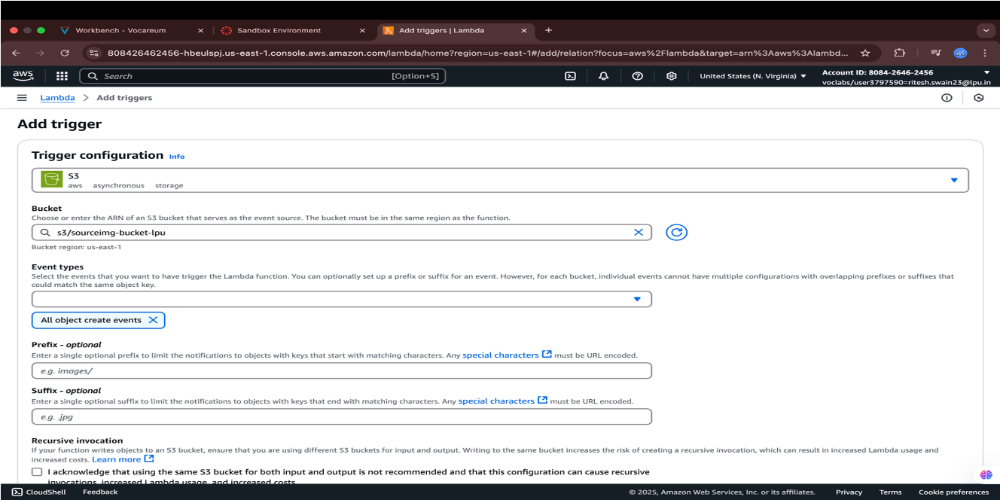
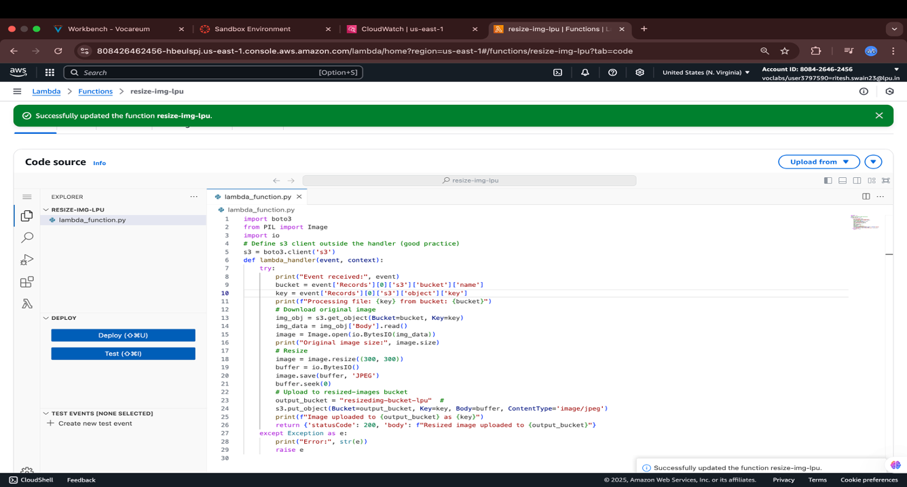
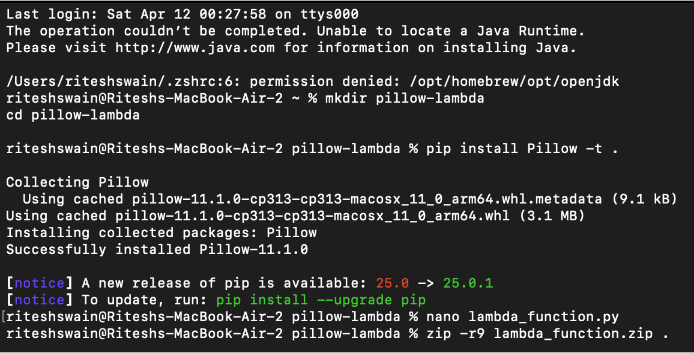
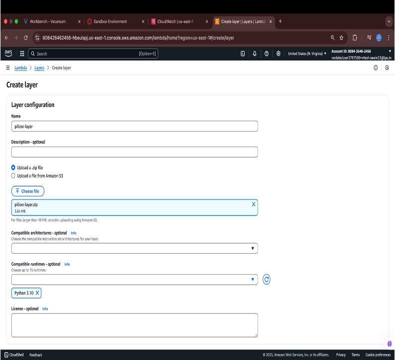
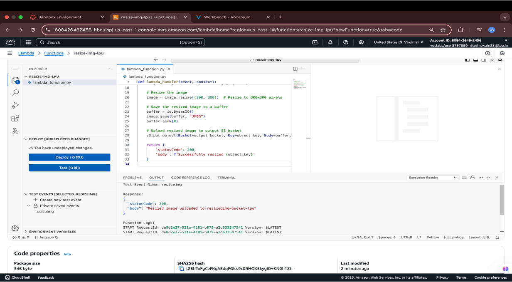
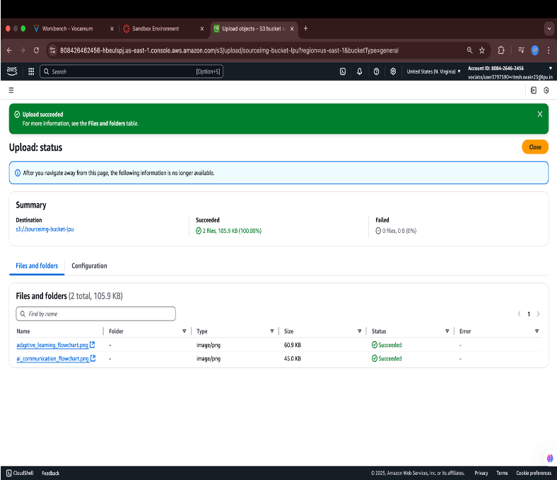
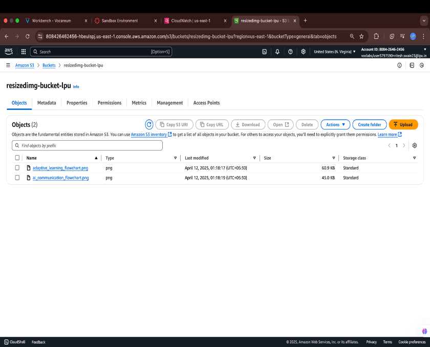
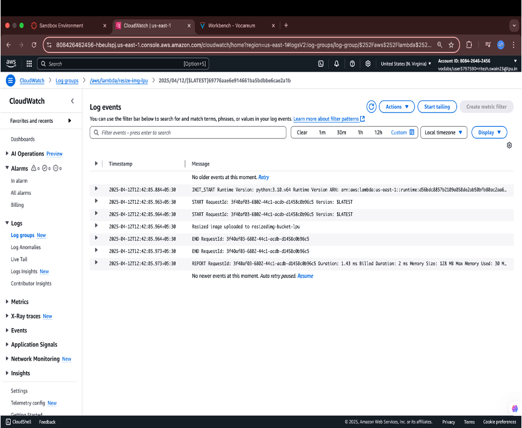

# 🖼️ Serverless Image Resizer (AWS Lambda + S3)  
*By **Ritesh Swain***  

> A proof-of-concept simulating **automated image resizing** using AWS Serverless services.  
> *(This project is archived due to AWS account closure.)*  

---

## ✨ Features  
- **Trigger**: Upload an image to `sourceimg-bucket-lpu`.  
- **Processing**: AWS Lambda resizes the image using Python (**Pillow**).  
- **Output**: Saves resized version to `resizedimg-bucket-lpu`.  
- **Logging**: CloudWatch tracks execution status.  

<p align="center">
  
</p>

---

## 🧰 AWS Services Used  

| **AWS Service**         | **Purpose**                                                                 |
|-------------------------|-----------------------------------------------------------------------------|
| **Amazon S3**           | Used as the source (`sourceimg-bucket-lpu`) and destination (`resizedimg-bucket-lpu`) for images. |
| **AWS Lambda**          | Core of the project. Executes image resizing logic when triggered by S3 events. |
| **Amazon CloudWatch**   | Captures Lambda execution logs (process start, upload success, etc.).        |
| **Lambda Test Events**  | Simulates S3 uploads for testing the Lambda function.                        |

---

## 🎥 Presentation  
[📥 **Download the presentation**](./assets/Presentation.pdf)

---

## 🛠️ Implementation Steps  

### 1. AWS Services Setup
- Created two S3 buckets:
  - **Source**: `sourceimg-bucket-lpu` (for original images)
  - **Destination**: `resizedimg-bucket-lpu` (for processed images)

<p align="center">
  
</p>

---

### 2. Lambda Function Creation
- Developed Python Lambda function with:
  - Python 3.x runtime
  - Basic execution role with S3 permissions

<p align="center">
  
</p>

---

### 3. S3 Event Trigger Setup
- Configuring the Lambda trigger so that it gets automatically invoked when an image is uploaded to the source S3 bucket.

<p align="center">
  
</p>

---

### 4. Image Resizing Logic
- Python code inside the Lambda function that simulates or performs image resizing and uploads to the target S3 bucket.
  - Resized images are saved to the destination S3 bucket.
  - Added logging to track execution status.

<p align="center">
  
</p>

---

### 5. Pillow Library (Python)  
- Used **Pillow** (`PIL`) for image processing.  
- Packaged dependencies as a **Lambda Layer**.  

```bash
pip install Pillow -t .

```

<p align="center"> 
  
</p>

---

### 6. Lambda Layer Creation
- Created a Lambda layer with the required dependencies (Pillow).
- Uploaded the layer to AWS Lambda.

<p align="center">  </p>

---

### 7. Lambda Test Event
- Created a test event to simulate an image upload to the source S3 bucket.
- Triggered the Lambda function with the test event.
- Verified the resized image was uploaded to the target S3 bucket.

<p align="center">  </p>

---

### 8. Image Resizing and Upload
- Uploaded an image to the source S3 bucket manually.
- Verified the Lambda function was triggered and the resized image was uploaded to the target S3 bucket.

<p align="center">  </p>

---

### 9. Resized Image Verification
- Verified the resized image was uploaded to the target S3 bucket.
- Checked the image dimensions to ensure it was resized correctly.

<p align="center">  </p>

---

### 10. Cloud Watch Logs
- Verified the CloudWatch logs to ensure the Lambda function executed successfully.
- Checked for any errors or exceptions.
- Verified the logs contained the expected information.

<p align="center">  </p>

---

## 📌 License
This project is open-source and available under the MIT License.

[MIT LICENSE](LICENCE)
